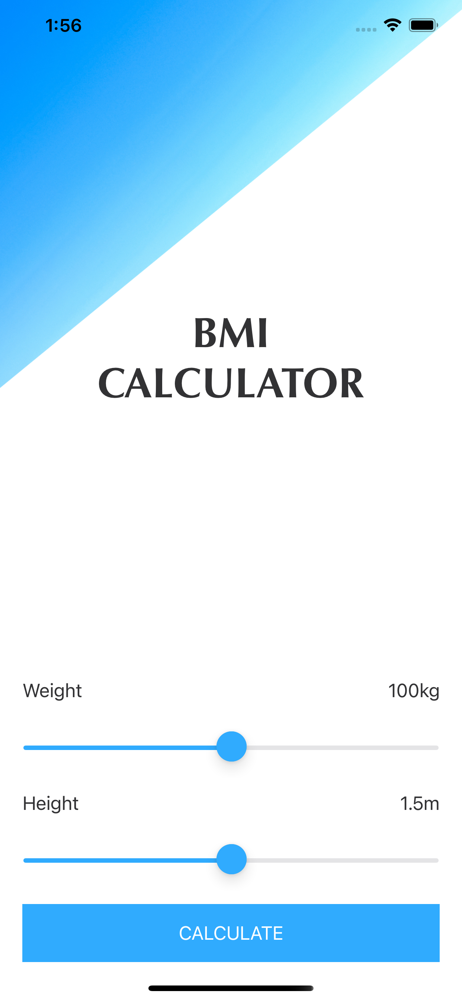
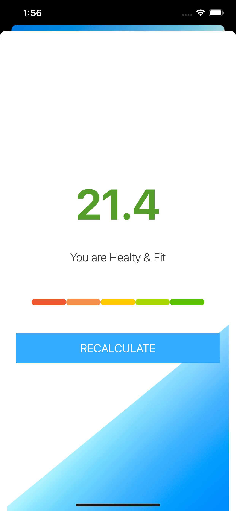
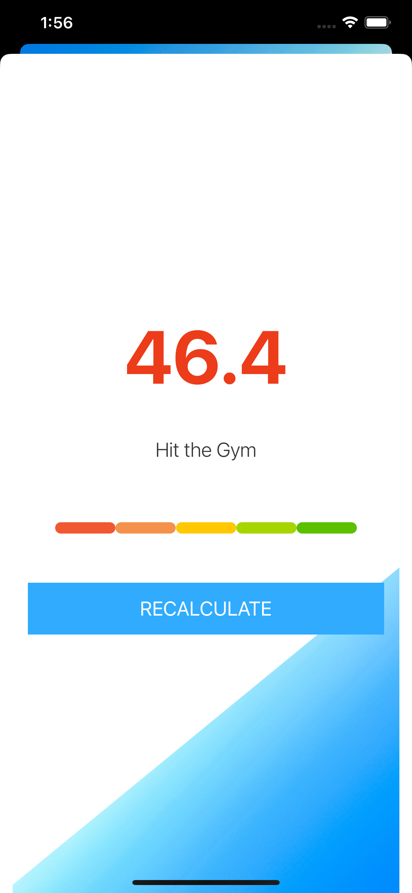

# BMI Calculator

A simple Body Mass Index (BMI) calculator app built using UIKit. The app allows users to input their weight and height, calculates their BMI, and provides health advice based on the result.

## Features
- Input weight and height using sliders.
- Calculate BMI based on user input.
- Display BMI value along with color-coded health advice.
- Option to recalculate BMI.

## Screenshots

- **Main Tab View:** Home page showing weight and height sliders.

- **Show calculation:** Healthy calculated segue.

- **Show calculation:** Hit the gym segue.


## Installation

1. Clone the repository:
   ```bash
   git clone https://github.com/ahmedhalilovic/BMICalculator.git
   ```

2. Open the project in Xcode:
   ```bash
   cd BMICalculator
   open BMICalculator.xcodeproj
   ```

3. Build and run the app on a simulator or a physical device.

## Usage

1. Adjust the weight and height sliders to input your values.
2. Tap the **Calculate** button to see your BMI result.
3. The app will display your BMI value and health advice based on your BMI range.
4. Tap **Recalculate** to adjust the values and calculate again.

## Code Overview

### 1. **BMIViewController.swift**
Handles the main view where users input their weight and height. It also calculates the BMI and navigates to the results screen.

Key features:
- Slider actions for weight and height.
- Passing calculated BMI, health advice, and color to the results screen via a segue.

### 2. **ResultViewController.swift**
Displays the BMI result, color-coded advice, and an option to recalculate BMI.

Key features:
- Displays the BMI value.
- Shows health advice and adjusts text color based on the BMI result.

### 3. **CalculateBMI.swift**
Contains the logic for calculating BMI and determining the advice and color based on the result.

Key features:
- Calculates BMI using the formula `weight / height^2`.
- Provides advice and a corresponding color based on BMI ranges:
  - BMI < 18.4: **Eat more Fish and Chips** (Blue)
  - BMI 18.5 - 24.9: **You are Healthy & Fit** (Green)
  - BMI 25.0 - 29.9: **Eat less and control yourself** (Yellow)
  - BMI >= 30.0: **Hit the Gym and do not eat at all** (Red)

### 4. **BMI.swift**
A simple data structure to store BMI values, health advice, and the associated color.

Key features:
- Stores the BMI value.
- Contains health advice as a string.
- Provides a color for displaying the result.

## Contributing

Feel free to contribute to this project by submitting a pull request. For major changes, please open an issue first to discuss what you'd like to change.

## License

This project is licensed under the MIT License. See the [LICENSE](LICENSE) file for details.
